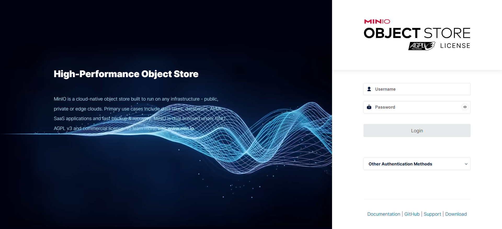
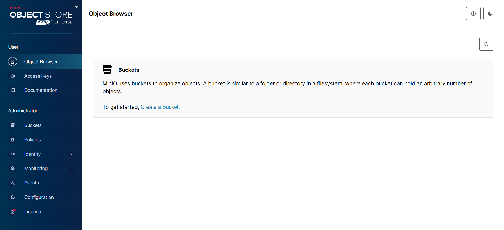

## Docker安装Minio服务

### Minio简介

MinIO是一个开源的对象存储服务器，它兼容Amazon S3 API，并提供高性能、高可用性的存储解决方案

官网：https://min.io/docs/minio/linux/index.html?ref=con

### 创建文件夹

```shell
$ mkdir -p /data/minio/data
```

### 配置文件
#### docker-compose.yml

```yaml
version: '3'
services:
  minio:
    image: minio/minio
    container_name: minio
    ports:
      - 9010:9000
      - 9011:9011
    environment:
      TZ: Asia/Shanghai
      MINIO_ACCESS_KEY: minio
      MINIO_SECRET_KEY: minio123
    volumes:
      - ./data:/data
    command: server /data --console-address ":9011"
```


> [!NOTE]
1、minio容器默认使用两个端口，9000和9001 9000端口主要适用于数据传输，9001端口主要是用于管理界面，上述文件中我为了好记且避免端口冲突，将9000端口映射到了服务器的9010端口，将9001端口改成了9011并映射到了服务器的9011端口 <br/>
2、数据卷映射： 默认将数据卷映射到了docker-compose.yml同文件目录下的data文件夹<br/>
3、command: server --console-address ‘:9011’ /data 这行一定要加，否则端口号是随机的，你压根映射不出去<br/>
4、新版本中用户名和密码改用成了 “MINIO_ROOT_USER” 和 “MINIO_ROOT_PASSWORD” 旧版本是 “MINIO_ACCESS_KEY” 和 “MINIO_SECRET_KEY” 可以自己按照版本进行设置。<br/>
5、这里配置了minio的登录用户市minio,密码是123456<br/>


### 构建Minio服务

```shell
$ docker-compose up -d
```

### 放行防火墙端口

> [!NOTE]
> 如果在本地虚拟机，只需要关闭防火墙即可。如果是云服务器，需要在安全组配置准入规则，开放15672端口，如果防火墙开启了，需要在防火墙的配置15672端口放行，重启防火墙才可以。

### 访问测试

 <br/>
 <br/>