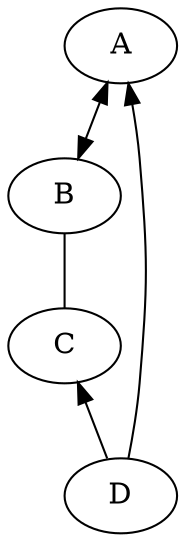

## Docker安装RabbitMQ服务

### 测试代码

```java
public static void main(string[] args){
	
}

```

> [!NOTE]
> An alert of type 'note' using global style 'callout'.

> [!TIP]
> An alert of type 'tip' using global style 'callout'.


> [!WARNING]
> An alert of type 'warning' using global style 'callout'.


> [!DANGER]
> An alert of type 'danger' using global style 'callout'.


> [!NOTE|style:flat]
> An alert of type 'note' using alert specific style 'flat' which overrides global style 'callout'.


> [!COMMENT]
> An alert of type 'comment' using style 'callout' with default settings.

