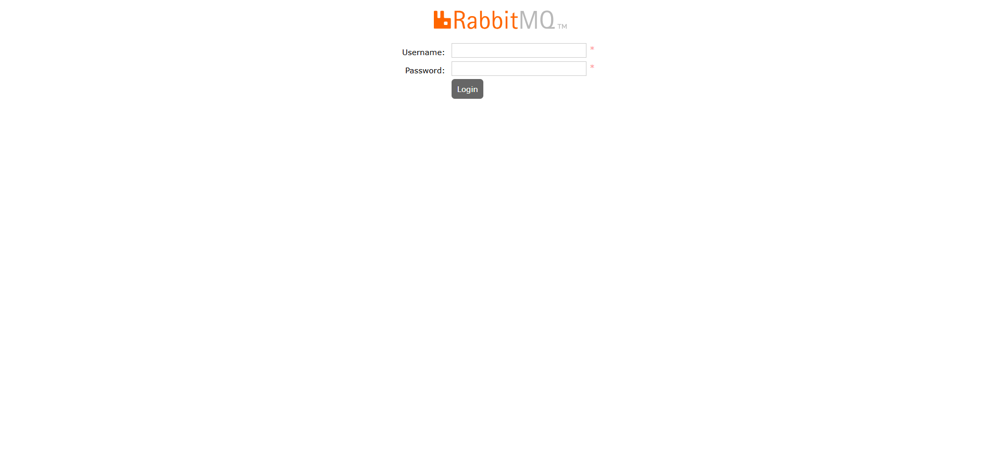

## Docker安装RabbitMQ服务

### 配置文件
#### docker-compose.yml

```yaml
version: "3.5"
services:
  rabbitmq:
    image: rabbitmq:3.8
    container_name: rabbitmq
    restart: always
    hostname: rabbit-server
    environment:
       CONTAINER_TIMEZONE: Asia/Shanghai
       # 默认虚拟机名
       #RABBITMQ_DEFAULT_VHOST: admin_vhost
       # 用户名
       #RABBITMQ_DEFAULT_USER: root
       # 密码
       #RABBITMQ_DEFAULT_PASS: root
    volumes:
      - ./data/:/var/lib/rabbitmq:rw
      - ./config/rabbitmq.conf:/etc/rabbitmq/rabbitmq.conf
    ports:
      - 5672:5672
      - 15672:15672

```

#### rabbitmq.conf

```conf
# RabbitMQ Setting
loopback_users.guest = false
listeners.tcp.default = 5672
management.tcp.port = 15672
connection_max = 1024

default_pass=root
default_user=root
default_vhost=rabbitmq-server

# Mqtt Setting
mqtt.vhost=rabbitmq-server
```

### 构建rabbitmq服务

```shell
$ docker-compose up -d
```

### 开启图形化管理界面
1.进入容器内部
```shell
$ docker exec -it rabbitmq /bin/bash
```

2.进入rabbitmq默认安装目录
```shell
# 进入rabbitmq的可执行命令目录
$ cd /opt/rabbitmq/sbin
```

3.开启图形化管理
```shell
# 图形化界面默认是关闭的，这里需要开启
$ ./rabbitmq-plugins enable rabbitmq_management
```

### 放行防火墙端口

> [!NOTE]
> 如果在本地虚拟机，只需要关闭防火墙即可。如果是云服务器，需要在安全组配置准入规则，开放15672端口，如果防火墙开启了，需要在防火墙的配置15672端口放行，重启防火墙才可以。


### 访问管理页面

> [!TIP]
> http://ip:15672/#/

 <br/>
 <br/>

