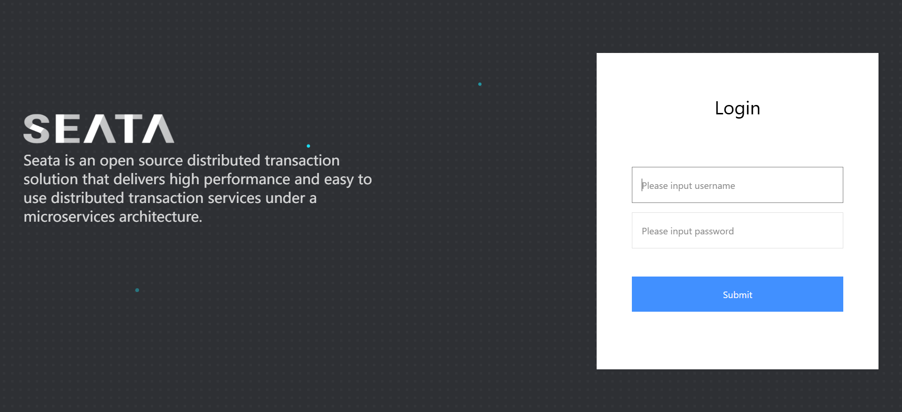
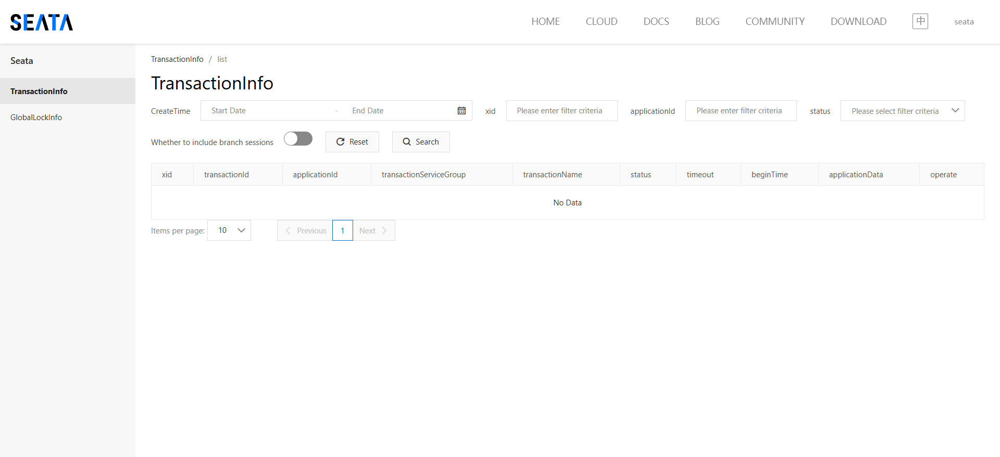

## Docker安装Seata服务

### 前置条件
seata服务会注册到nacos中，必须使用docker安装好nacos。

### 配置文件

#### docker-compose.yml

```yaml
version: "3.5"

services:
  yyleap-seata:
    image: seataio/seata-server:1.6.1
    container_name: yyleap-seata
    restart: always
    depends_on:
      - yyleap-mysql
      - yyleap-nacos
    ports:
      - 8091:8091
      - 7091:7091
    environment:
      - SEATA_IP=192.168.239.181
    volumes:
      - "./resources/application.yml:/seata-server/resources/application.yml"

```

#### application.yml

```yaml
server:
  port: 7091

console:
  user:
    username: seata
    password: seata

seata:
  config:
    # support: nacos, consul, apollo, zk, etcd3
    type: nacos
    nacos:
      server-addr: 192.168.239.181:8848
      namespace: af71071c-fa0d-4ca8-80a1-ecdbb2d2430d
      group: SEATA_GROUP
      dataId: 'seataServer.properties'
      username: nacos
      password: nacos
  registry:
    # support: nacos, eureka, redis, zk, consul, etcd3, sofa
    type: nacos
    nacos:
      application: seata-server
      server-addr: 192.168.239.181:8848
      group: SEATA_GROUP
      cluster: default
      namespace: af71071c-fa0d-4ca8-80a1-ecdbb2d2430d
      username: nacos
      password: nacos
  #  server:
  #    service-port: 8091 #If not configured, the default is '${server.port} + 1000'
  security:
    secretKey: SeataSecretKey0c382ef121d778043159209298fd40bf3850a017
    tokenValidityInMilliseconds: 1800000
    ignore:
      urls: /,/**/*.css,/**/*.js,/**/*.html,/**/*.map,/**/*.svg,/**/*.png,/**/*.ico,/console-fe/public/**,/api/v1/auth/login
```

### docker-compose构建seata服务

执行docker命令安装
```shell
$ docker-compose up -d
```

### 访问测试
> [!NOTE]
> 访问seata console网址 -> http://ip:7091 用户名和密码都是在application.yml中配置的，然后放行防火墙端口，就可以在浏览器上访问到。

 <br/>
 <br/>